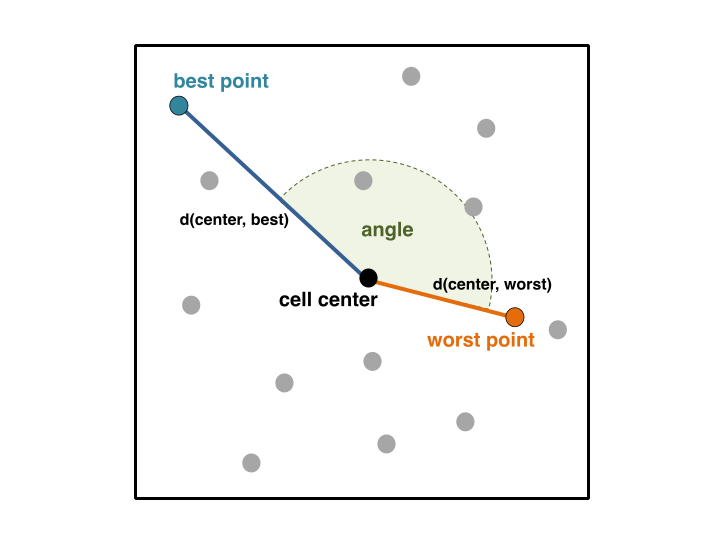
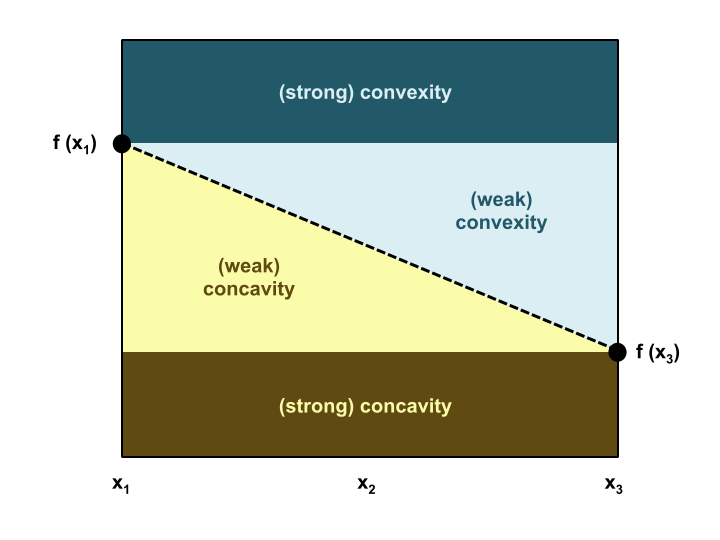
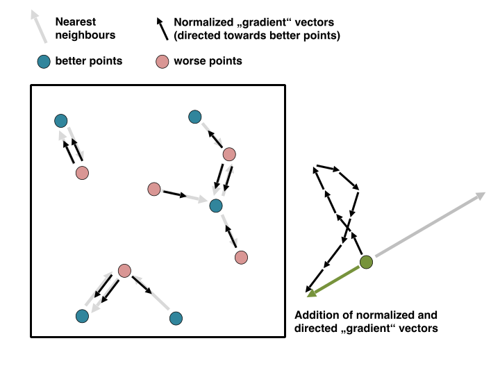

Cell Mapping Features
=====================
The idea of cell mapping is that a continuous search space is partitioned in every dimension and thus achieving a discretization of the original search space into cells.
This discretization of the original sample into cells allows the computation of features, which help to characterize the global structure or multimodality of an optimization problem.
Based on this approach, three different feature sets can be computed: angle (``calculate_cm_angle``), convexity (``calculate_cm_conv``) and gradient homogeneity (``calculate_cm_grad``).

Prerequisites
-------------
As will be clearer in the remainder of this page, all cell mapping features rely on the aforementioned cells. These cells are the product of the discretization of the decision space, where
each dimension is divided into ``blocks``. For the next example, we assume to have a two dimensional objective function/optimization problem.
Then, we could define ``block = 3`` or ``block = [3, 4]``. The former would yield :math:`3 \cdot 3 = 9` cells and the latter :math:`3 \cdot 4 = 12` cells.

It is important that:

* **each dimension has at least 3 blocks** and
* **each cell has at least 3 observations**.

Otherwise, the resulting feature values would not have any inherent predictive power.
As a result, all cell mapping features can only be calculated when the sample size :math:`n` of a :math:`d` dimensional problem instance fulfills the following requirements:

.. math::

    3 \cdot d^{blocks} \leq n

Angle
-----
The initial idea of the angle features (``calculate_cm_angle``) is that the best and worst values within the cells might return some insight of the underlying function’s landscape.
If those two observations lie in opposite directions, it indicates a trend within the cell.
In that case the angle between the vectors from cell center to worst value and cell center to best value would be close to 180°.
The angles of all cells from the grid will then be aggregated using the mean and the standard deviation.

.. code-block:: python3

   from pflacco.sampling import create_initial_sample
   from pflacco.classical_ela_features import calculate_cm_angle

   # Arbitrary objective function
   def objective_function(x):
      return sum(x**2)

   dim = 2
   # Create inital sample using latin hyper cube sampling
   X = create_initial_sample(dim, sample_type = 'lhs')
   # Calculate the objective values of the initial sample
   # using an arbitrary objective function
   y = X.apply(lambda x: objective_function(x), axis = 1)

   # Compute cell mapping angle feature set from the convential ELA features
   cm_angle = calculate_cm_angle(X, y, blocks = 3)

Furthermore, the standard deviation and mean of the lengths of the two above-mentioned vectors (i.e. distances from the center of a cell to the best/worst observation within that cell) are used as additional features. In case of simple functions (such as the sphere function), the variation should be low as the majority of the cells should have similar distances — due to the fact that they usually lie close to the borders of the cells. In case of very multimodal functions, the variation should be rather high as cells with local optima result in contrary distances (short distances of the best values and long distances of the worst values) compared to cells without any local optima.

Since interactions between cells are ignored, i.e. these features are computed locally per cell, the features are considered to be independent from the search space dimensionality.

(Inspired by Kerschke, P. et al., 2014 [#r1]_)

Cell Convexity
--------------
For this feature set (``calculate_cm_conv``), all possible combinations of three (linearly) neighbouring cells within the grid are computed.
Per default, only horizontally and vertically neighbouring cells are considered. By adding ``cm_conv_diag = True`` to function call, diagonally neighbouring cells are considered as well.

.. code-block:: python3

   from pflacco.sampling import create_initial_sample
   from pflacco.classical_ela_features import calculate_cm_conv

   # Arbitrary objective function
   def objective_function(x):
      return sum(x**2)

   dim = 3
   # Create inital sample using latin hyper cube sampling
   X = create_initial_sample(dim, sample_type = 'lhs')
   # Calculate the objective values of the initial sample
   # using an arbitrary objective function
   y = X.apply(lambda x: objective_function(x), axis = 1)

   # Compute cell mapping convexity feature set from the convential ELA features
   cm_conv = calculate_cm_conv(X, y, blocks = 3)

During the computation of the cell mapping convexity features, only the cells’ representatives are considered. Based on those prototypes, the concavity or convexity of the landscape is approximated.

Given the function evaluations of the three neighbouring cells, this feature computes the convex-combination between f(x\ :sub:`1`) and f(x\ :sub:`3`). That value is then compared to the corresponding value of f(x\ :sub:`2`).
The figure below illustrates the resulting decision, i.e. whether a combination indicates convexity or concavity. Just place the value of f(x\ :sub:`2`) above x\ :sub:`2` and infer the corresponding decision.

(Inspired by Kerschke, P. et al., 2014 [#r1]_)

Gradient Homogeneity
--------------------
For every point within a cell’s sample, the nearest neighbor is identified and afterwards, the normalized vectors, which are always rotated towards the better points, are computed.
Then, all normalized vectors are summed up and divided by the maximal possible vector length (i.e. the number of points).
In case of rather randomly distributed objective values, the fraction should be close to zero as this would indicate vectors, which are pointing in different directions.
In case of a strong trend the value should be close to one (i.e., all vectors point into the same direction).

.. code-block:: python3

   from pflacco.sampling import create_initial_sample
   from pflacco.classical_ela_features import calculate_cm_grad

   # Arbitrary objective function
   def objective_function(x):
      return sum(x**2)

   dim = 3
   # Create inital sample using latin hyper cube sampling
   X = create_initial_sample(dim, sample_type = 'lhs')
   # Calculate the objective values of the initial sample
   # using an arbitrary objective function
   y = X.apply(lambda x: objective_function(x), axis = 1)

   # Compute cell mapping convexity feature set from the convential ELA features
   cm_grad = calculate_cm_grad(X, y, blocks = 3)

Those values are then aggregated over all cells — again, using the mean and the standard deviation. Simple unimodal functions shall thus generate very high mean values.

(Inspired by Kerschke, P. et al., 2014 [#r1]_)

.. rubric:: Literature Reference

.. [#r1] Kerschke, P., Preuss, M., Hernandez, C., Schuetze, O., Sun, J.-Q., Grimme, C., Rudolph, G., Bischl, B., and Trautmann, H. (2014): “Cell Mapping Techniques for Exploratory Landscape Analysis”, in: EVOLVE — A Bridge between Probability, Set Oriented Numbers, and Evolutionary Computation V, pp. 151—131, Springer (http://dx.doi.org/10.1007/978-3-319-07494-8_9).