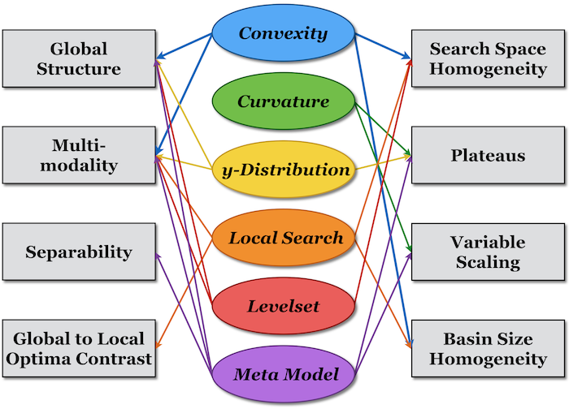

Classical ELA Features
======================
The term *Exploratory Landscape Analysis (ELA)* features (as introduced by Mersmann et al., 2011 [#r1]_) summarizes a group of characteristics, which quantifies certain properties of a continuous optimization problem.
In its original version, ELA covered a total of 50 features - grouped into six so-called low-level properties (Convexity, Curvature, y-Distribution, Levelset, Local Search and Meta Model).
These (numerical values) were used to characterize (usually categorical and expert-designed) high-level properties, such as the Global Structure, Multimodality or Variable Scaling.
The figure below visualizes the connections between the low- and high-level properties.

(Inspired by Mersmann et al., 2011 [#r1]_)

A detailed description of the features can be found in Mersmann et al. (2011) [#r1]_.
Below you find a code example.

.. code-block:: python3

   from pflacco.sampling import create_initial_sample
   from pflacco.classical_ela_features import *

   # Arbitrary objective function
   def objective_function(x):
      return sum(x**2)

   dim = 3
   # Create inital sample using latin hyper cube sampling
   X = create_initial_sample(dim, sample_type = 'lhs')
   # Calculate the objective values of the initial sample
   # using an arbitrary objective function
   y = X.apply(lambda x: objective_function(x), axis = 1)

   # Compute the 3 feature sets from the classical ELA features which are solely based on the initial sample
   ela_meta = calculate_ela_meta(X, y)
   ela_distr = calculate_ela_distribution(X, y)
   ela_level = calculate_ela_level(X, y)
   
   # Compute the remaining 3 feature sets from the classical ELA features which do require additional function evaluations
   ela_local = calculate_ela_local(X, y, f = objective_function, dim = dim, lower_bound = -1, upper_bound = 1)
   ela_curv = calculate_ela_curvate(X, y, f = objective_function, dim = dim, lower_bound = -1, upper_bound = 1)
   ela_conv = calculate_ela_conv(X, y, f = objective_function)

.. rubric:: Literature Reference

.. [#r1] Mersmann et al. (2011), “Exploratory Landscape Analysis”, in Proceedings of the 13th Annual Conference on Genetic and Evolutionary Computation, pp. 829—836. ACM (http://dx.doi.org/10.1145/2001576.2001690).