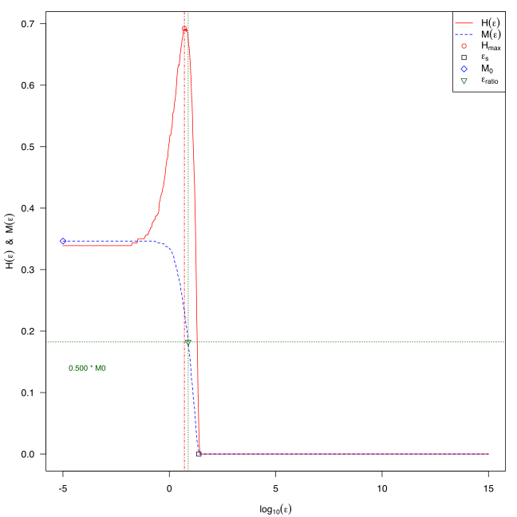

Information Content-Based Features
==================================
In the *Information Content of Fitness Sequences (ICoFiS)* approach, the information content of a continuous landscape, i.e., smoothness, ruggedness, or neutrality, are quantified.
While common analysis methods were able to calculate the information content of discrete landscapes, the ICoFiS approach provides an adaptation to continuous landscapes that accounts e.g. for variable step sizes in random walk sampling.

This method quantifies the changes in fitness between neighbours while accounting for the distance between two neighbours in the continuous space.
Abstracting from the actual values of change, the landscape is transformed into a symbol sequence, indicating whether a positive, negative, or neutral change was performed between to values.

Afterwards, every two consecutive symbols compose a block in the fitness landscape.
The information content is then derived from the observed probabilities of all blocks that are composed of two different symbols (e.g., a change from positive to negative or from neutral to positive).

As a further measure, the partial information content is proposed.
It is calculated from a modified symbol sequence that omits any neutral changes and repeated symbols.
However, the authors (see below) state that the partial information content does not yield much additional information for the increased calculation complexity.
For a complete overview of the features, please refer to the documentation of :func:`pflacco.classical_ela_features.calculate_information_content` and Muñoz et al. (2015) [#r1]_.

Below you find an example of the partial information content features, as well as a visualisation.

.. code-block:: python3

   from pflacco.sampling import create_initial_sample
   from pflacco.classical_ela_features import calculate_information_content

   # Arbitrary objective function
   def objective_function(x):
      return sum(x**2)

   dim = 3
   # Create inital sample using latin hyper cube sampling
   X = create_initial_sample(dim, sample_type = 'lhs')
   # Calculate the objective values of the initial sample
   # using an arbitrary objective function
   y = X.apply(lambda x: objective_function(x), axis = 1)

   # Compute ic feature set from the convential ELA features
   ic = calculate_information_content(X, y)

.. ::rubric:: Literature Reference

.. [#r1] Muñoz, M. et al. (2015), “Exploratory Landscape Analysis of Continuous Space Optimization Problems Using Information Content”, in IEEE Transactions on Evolutionary Computation (19:1), pp. 74—87 (http://dx.doi.org/10.1109/TEVC.2014.2302006).